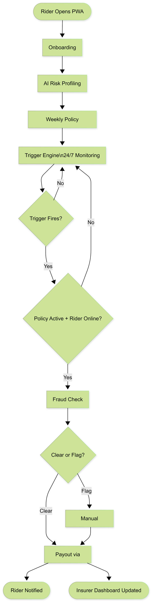

# Coverent
## Parametric Income Insurance for Q-Commerce Riders

> Automated weekly income protection for Zepto / Blinkit / Swiggy Instamart delivery partners. When a disruption is detected, the payout goes out automatically. No claim forms. No waiting.

---

## The Problem

A full-time Blinkit or Zepto rider earns ₹800–₹1,200/day working 9–10 hours out of a single dark store. Their entire income depends on a 1.5–2km delivery radius staying operational.

One flooded road, one severe AQI day, one platform outage during peak hours — and that day's income is gone. No compensation. No safety net. Over a Delhi monsoon season, riders lose 4–6 such days, translating to ₹3,800–₹5,700 in unprotected income loss.

Coverent insures that lost income — automatically, weekly, and built exclusively for Q-Commerce riders.

---

## Persona: The Q-Commerce Rider

- Works out of one fixed dark store (Zepto / Blinkit / Swiggy Instamart)
- Delivers within a 1.5–2km radius, completing 3–5 orders/hour at peak
- Earns ₹20–₹35/order base + distance pay + milestone incentives
- Peak earning window: 6–11 PM (~40% of daily income)
- Weekly earnings: ₹3,000–₹7,200 depending on city and hours worked

The 10-minute delivery promise means even a 45-minute disruption during peak hours causes disproportionate income loss — not just fewer orders, but missed incentive slabs too.

---

## Worker Scenarios

### Scenario 1 — Ravi, Blinkit Rider, Delhi (Monsoon Waterlogging)

Ravi earns ₹950/day from a dark store in Rohini. On August 13, 2024, IMD issues a Red Alert for Delhi-NCR — two roads within 2km of his store are waterlogged by 11 AM. He cannot safely ride.

**Without Coverent:** ₹950 gone. Over 4–6 such days per monsoon season, that's ₹3,800–₹5,700 with zero recourse.

**With Coverent:** IMD Red Alert + maps API confirms flooding within 2km of his dark store. Trigger fires. ₹665 credited to UPI by 2 PM — while the roads are still flooded.

---

### Scenario 2 — Priya, Zepto Rider, Delhi (Severe AQI)

Priya works the 6–11 PM peak slot in Dwarka, earning ₹780/evening. On November 18, 2024, Delhi's AQI hits 491. She logs off after 90 minutes — 6 orders instead of 18–20. Evening earnings: ₹210.

**Without Coverent:** ₹570 lost. Delhi's AQI exceeded 400 for 9 consecutive days in November 2024 with zero recourse.

**With Coverent:** AQI ≥301 confirmed in Dwarka for 3+ consecutive hours during her active shift. Trigger fires. ₹455 to UPI within 2 hours.

---

### Scenario 3 — Arjun, Swiggy Instamart Rider, Mumbai (Platform Outage)

Arjun earns ₹1,050/day in Andheri West. On a Friday at 7:23 PM, Swiggy's order-assignment system goes down for 52 minutes. He 
completes 4 orders instead of his usual 14 and misses his weekly incentive milestone by the exact orders the outage cost him.

**Without Coverent:** ₹280 order loss + ₹300 missed bonus = ₹580 gone on a single Friday night.

**With Coverent:** Downtime >45 minutes during peak detected. GPS confirms Arjun was active in zone. Fraud check clears. ₹385 to UPI before midnight.

---

## Platform Choice: Hybrid (PWA + Web Dashboard)

**Rider Interface — Progressive Web App (PWA)**
Every Q-Commerce rider owns a smartphone — it is a mandatory requirement to join Blinkit, Zepto, or Swiggy Instamart. A PWA is accessible via browser link, installable to home screen, and push-notification capable with zero installation barrier. No Play Store approval, no storage friction, works on any Android device.

**Insurer / Admin Interface — Web Dashboard**
The insurer-side user monitors live triggers, reviews flagged claims, and tracks loss ratios at a desk. This requires data-dense views — maps, charts, claim queues — that are web-only use cases.

**Result:** Two interfaces, one backend, right tool for each user.

---

## Application Workflow

<p align="center">
  
</p>

### Rider PWA (6 Steps)

**Step 1 — Onboarding (one-time, ~3 min)**
Phone login → select platform → platform ID → dark store pincode → UPI ID → income tier (Low/Mid/High) → shift window.

**Step 2 — AI Risk Profiling (automatic, ~60 sec)**
No rider action. Zone scored (0–100) from historical weather + AQI data. Rider sees: *"Zone risk: 74/100. 
Recommended: Suraksha Plus."*

**Step 3 — Weekly Policy Purchase**
Select plan → pay via UPI → active Monday to Sunday → auto-renewal prompt every Sunday.

**Step 4 — Trigger Monitoring (continuous, no rider action)**
System polls weather, AQI, and platform APIs automatically. Trigger fires only if policy is active and rider was online.

**Step 5 — Auto Claim + Fraud Check (<2 min)**
3 checks run simultaneously: GPS validation, duplicate check, anomaly detection. All pass → approved. Any flag → manual review.

**Step 6 — Payout**
Amount calculated → sent to UPI → push notification to rider. Target: within 2 hours of trigger.

---

### Insurer Web Dashboard

| View | What It Shows |
|---|---|
| Live Trigger Map | Active events by type (waterlogging/heat/AQI/closure/outage) with zone overlays. Affected riders per zone. |
| Claims Queue | Auto-approved claims (last 24 hrs) + flagged claims with fraud check detail and rider GPS trail. |
| Analytics | Loss ratio, zone-wise claim heatmap, 7-day payout forecast, renewal rate. |
| Policy Management | Active policies, tier distribution, zone risk override, CSV export. |

---

## Weekly Premium Model

### Why Weekly?

77.6% of gig workers in India earn ₹2.5 lakh or less per year. Zepto and Blinkit both run weekly payout cycles (Monday–Sunday, credited by Tuesday). Coverent's premium deducts from that payout automatically — the rider never needs to actively pay. Zero friction, zero defaults.

### Income Tiers

| Tier | Weekly Earnings | Monthly Equivalent | Profile |
|---|---|---|---|
| Low | ₹3,000–₹4,200 | ₹12,000–₹15,000 | Part-time / Tier-2 city |
| Mid | ₹4,800–₹6,000 | ₹25,000–₹30,000 | Full-time / Metro |
| High | ₹6,600–₹7,200 | ₹30,000–₹40,000 | High-performer / Metro |

*Source: Blinkit/Zepto official partner earnings data, Invezz gig worker survey 2025*

### Premium Formula

```
Weekly Premium = (Base Premium + AI Risk Loading) × Plan Multiplier
```

**Base Premium — 2.5% of weekly income (parametric microinsurance benchmark)**

| Tier | Base Premium |
|---|---|
| Low | ₹89/week |
| Mid | ₹139/week |
| High | ₹179/week |

**AI Risk Loading — XGBoost model, range: -₹20 to +₹30**
Calculated at onboarding based on zone history. Neutral score = 74.

| Input Feature | Source | Weight |
|---|---|---|
| 3-year waterlogging frequency (pincode) | IMD historical | High |
| Seasonal AQI severity score | CPCB / AQICN historical | High |
| City tier (metro / Tier-2 / Tier-3) | Registration data | Medium |
| Dark store zone composite risk score | City flood + OSM maps | Medium |
| Rider's active shift window | Platform API (simulated) | Low |
| Rider's prior claim count | Internal DB | Low |

*Example: Mid-tier rider in Rohini, Delhi pays ₹169/week. Same tier in Kharadi, Pune pays ₹119/week.*

### Coverage Plans (Mid-Tier Benchmark)

| Plan | Max Covered Days/Week | Max Payout/Week |
|---|---|---|
| Suraksha Lite | 1 day | ₹630 |
| Suraksha Plus | 2 days | ₹1,260 |
| Suraksha Max | 3 days | ₹1,890 |

### Payout Formula

```
Payout = Base Daily Payout × Severity Multiplier
```
*Where Base Daily Payout = (Weekly Income ÷ 6) × 0.70*

The 0.70 factor prevents over-insurance moral hazard.

**Severity Multiplier (Based on API Trigger Intensity)**
- **Moderate (≤ 5.0):** 30% Payout
- **High (≤ 8.0):** 60% Payout
- **Severe (> 8.0):** 100% Payout

**Example:** Mid-tier rider earning ₹5,400/week during a "Severe" Rainfall trigger (Intensity 9.2) receives `(₹5,400 ÷ 6) × 0.70 × 1.0 = ₹630 → UPI within 2 hours`.

**Loss ratio estimate** (10,000 riders, Delhi-NCR + Mumbai):
- Peak monsoon (1.2 disrupted days/rider/week): ~45%
- Off-season (0.3 days/week): ~11%
- **Blended annual: ~28%** — commercially sustainable

### Hyperlocal Pool Protection
**Coverent** implements a safety valve at the pincode level. If a specific zone's loss ratio exceeds **85%**, new policy enrollments are paused to guarantee full payouts for existing members.

---

## Parametric Triggers

Five triggers. All objective, all API-verifiable, all tied directly to income loss within a rider's 2km zone. Trigger fires → payout initiates. No claim filing.

| # | Trigger | Exact Threshold | Income Loss Mechanism | Data Source |
|---|---|---|---|---|
| 1 | Hyperlocal Waterlogging | IMD Red Alert (≥64.5mm/day) AND ≥1 road within 2km of dark store flooded | Zone completion collapses; rider cannot operate | OpenWeatherMap + Google Maps |
| 2 | Extreme Heat | IMD Heat Wave (≥45°C) AND platform completion rate <40% for ≥2 hrs | Riders log off; cannot sustain peak delivery pace | OpenWeatherMap + Simulated platform API |
| 3 | Severe AQI | CPCB AQI ≥301 in rider's pincode for ≥3 consecutive hours during shift | Respiratory stress forces early log-off; 6–10 delivery cycles lost | AQICN API |
| 4 | Zone / Market Closure | Municipal/police order closing dark store zone or delivery zone | Dark store shuts; riders cannot enter/exit zone | Simulated municipal alert API |
| 5 | Platform Outage | Order-assignment system down ≥45 mins during 6–10 PM peak | Rider active but receives zero orders; peak = ~40% of daily earnings | Simulated platform status API |
---

## AI/ML Integration Plan

Three models. Each has one job, specific inputs, and a specific output.

### Model 1 — Zone Risk Scoring Engine

**Job:** Score a rider's zone at onboarding → determine AI risk loading on weekly premium.
**Algorithm:** XGBoost Regressor — best-performing model for tabular insurance risk data with mixed feature types.
**Inputs (6):** 3-year waterlogging frequency, seasonal AQI score, city tier, zone composite risk score, shift window, prior claim count.
**Output:** Risk score (0–100) → premium adjustment (-₹20 to +₹30). Runs at onboarding, refreshed every 4 weeks.

#### XGBoost Model Architecture & Approach

**1. Model Objective & Hyperparameters**
The engine uses an `XGBRegressor` with a `reg:squarederror` objective to predict a continuous risk score. To ensure a balance between accuracy and computational efficiency for mobile onboarding, we use:
- **n_estimators:** 100
- **max_depth:** 5
- **learning_rate:** 0.1
- **Random State:** 42 (for reproducible risk scoring)

**2. Feature Engineering Logic**
| Feature | Weight (Approx) | Rationale |
|---|---|---|
| `zone_flood_score` | High | Directly correlates with physical access disruption. |
| `zone_aqi_score` | Medium-High | Causes health-related log-offs and reduced order volume. |
| `historical_claim_rate` | Medium | Flags repeat "hotspots" of disruption across the fleet. |
| `shift_pattern_score` | Medium | Evening riders face higher visibility and traffic-related risk. |
| `city_tier` | Low | Metro zones have higher base infrastructure but higher congestion. |

**3. Our Approach: Explainable & Equitable AI**
- **Hyperlocal Context:** Unlike traditional insurance that uses city-wide data, our model operates on **pincode-level granularity**, ensuring a rider in a safe pocket of a high-risk city isn't unfairly penalized.
- **Rider Transparency:** The "Risk Profile" screen in the PWA translates these 6 features into human-readable scores (e.g., "Critical AQI Risk"), making the premium loading transparent and justifiable.
- **Regularization:** Standard regularization techniques are applied to handle the "cold-start" problem for new dark stores with limited historical claim data.

**4. Core Assumptions**
- **Disruption Stationarity:** We assume that 3-year historical climate patterns are a valid predictive baseline for the upcoming 4-week policy window.
- **Pincode Centricity:** The model assumes the rider spends >80% of their shift within the 2km radius of their registered dark store.
- **Linear Feature Accumulation:** We assume that multiple risks (e.g., Heat + AQI) have an additive effect on the probability of a disruption event.

---

### Model 2 — Fraud Detection Engine

**Job:** Validate every auto-triggered claim before payout releases. CLEAR → instant payout. FLAG → manual review.
**Algorithm:** Isolation Forest (unsupervised anomaly detection) — requires no labeled fraud data at launch. Learns normal claim behavior and flags deviations.

| Check | Flag Condition |
|---|---|
| GPS zone validation | Last ping outside 2km of registered dark store |
| Activity validation | Rider logged off >30 min before trigger fired |
| Duplicate claim check | Same trigger type claimed twice in 7-day window |
| Velocity anomaly | GPS jump >5km in <3 minutes |
| Historical pattern check | Claim in zone with no prior disruption history for this trigger |

**Output:** CLEAR or FLAG (review target: 4 hours).

---

### Model 3 — Predictive Disruption Forecaster

**Job:** Power the insurer dashboard's 7-day payout liability forecast.
**Algorithm:** LSTM — chosen for modeling seasonal patterns like monsoon cycles and AQI spikes. Falls back to XGBoost regressor if not completed in time.
**Inputs:** 7-day weather + AQI forecast, historical trigger frequency by zone, active enrolled riders per zone.
**Output:** Estimated claims + payout liability per zone for the next 7 days. Runs every Sunday night.

*All models trained on synthetic data generated from real IMD/CPCB historical records. In production, Models 1 and 3 retrain quarterly. Model 2 updates its anomaly baseline continuously.*

---

## Adversarial Defense & Anti-Spoofing Strategy

> **Context:** A coordinated ring of 500 riders using GPS spoofing
> apps can fake their location into a Red Alert zone and trigger
> mass auto-payouts. Simple GPS verification is insufficient.
> Coverent defends at three layers.

---

### Layer 1 — Differentiating a Genuine Worker from a Spoofer

A real stranded rider leaves a physical trail a spoofing app
cannot replicate. Isolation Forest cross-checks 5 signals:

| Signal | Genuine Worker | Spoofer |
|---|---|---|
| Location history | Gradual movement toward dark store, then stops | Teleports into zone at trigger time |
| Accelerometer + battery | Shows bike motion, normal drain | Flat — stationary device |
| Platform activity | Online and accepting orders before trigger | Login spike exactly at trigger, no prior activity |
| Cell tower vs GPS | Tower pings match dark store vicinity | Tower pings contradict GPS coordinates |
| Zone order history | 4-week delivery pattern in this zone | No prior history in this zone |

**Flag condition:** Any 2 of 5 signals contradict GPS claim →
held for review. All 5 consistent → auto-approved.

---

### Layer 2 — Catching a Coordinated Ring (Population-Level Checks)

Individual checks catch solo spoofers. A ring of 500 needs
zone-level detection:

- **Claim velocity:** If claims in a zone spike >3 standard
  deviations above historical baseline within 15 minutes →
  entire zone's auto-approval paused.
- **Payout-to-active ratio:** Claims exceeding 140% of riders
  verified active in the 2 hours pre-trigger → excess flagged.
  Real disruptions only affect riders who were working.
- **Coordination fingerprint:** 10+ riders in the same zone
  showing GPS jumps within a 60-second window → coordinated
  spoofing escalated to insurer review.

---

### Layer 3 — Protecting Honest Workers from False Positives

A rider with a genuine network drop should never lose their payout.

- Flagged claims are **held, not rejected** — payout is reserved.
- Rider notified immediately: *"Claim under review — resolved
  within 4 hours. Payout protected if disruption is confirmed."*
- A rider failing only the GPS check (network drop) but passing
  the other 4 signals → **auto-approved.**
- System tuned to **95% recall on genuine claims** — fewer than
  5% of legitimate claims are incorrectly flagged.

---

### Defense Summary

| Attack | Defense |
|---|---|
| Solo GPS spoof | 5-signal Isolation Forest check |
| Ring of 500 claiming at once | Claim velocity + active-rider ratio |
| Coordinated spoofing app | Cross-zone fingerprint detection |
| Honest rider with network drop | 4-signal fallback + grace hold |

---

## Tech Stack

| Layer | Technology | Reason |
|---|---|---|
| Frontend | React.js (PWA + Web Dashboard) | One codebase for both interfaces; largest community; CRA sets up PWA in one command |
| Backend | Python + FastAPI | Beginner-friendly, auto Swagger docs at /docs, async support for trigger polling |
| Database | Firebase Firestore | Zero setup, real-time sync, free tier (50k reads/day), no SQL required |
| Auth | Firebase Auth | OTP-based mobile login, free |
| ML | scikit-learn + xgboost | Industry standard, best documentation, beginner accessible |
| Payments | Razorpay (test mode) | Free sandbox, UPI support |
| Hosting | Vercel (frontend) + Render.com (backend) | Both free tier, zero DevOps overhead |

**Total infrastructure cost: ₹0**

### Integrations

| Tool | Purpose | Cost |
|---|---|---|
| OpenWeatherMap | Rainfall, temperature, weather alerts | Free |
| AQICN | Real-time AQI by city/pincode | Free |
| Google Maps / OpenStreetMap | 2km radius zone check, flood layer | Free |
| Razorpay | Payout sandbox | Free |
| React Router | PWA and Dashboard navigation | — |
| Recharts | Insurer dashboard analytics charts | — |
| Lucide React | High-fidelity iconography | — |
| Firebase Cloud Messaging | Push notifications to rider PWA | — |

**Simulated in-house (mock FastAPI endpoints):**
- Platform order completion rate by zone
- Platform outage status feed
- Municipal zone closure alert feed

---

## Local Development Setup

To run **Coverent** locally on your workstation, follow these steps in order.

### 1. Prerequisites
- **Python 3.9+**
- **Node.js (v18+) & npm**
- **Firebase Account** (Firestore & Auth enabled)
- **Git** (for cloning)

### 2. Backend Environment (FastAPI)
The backend manages rider registration, ML pricing logic, and payout logs.

1. Navigate to the backend directory:
   ```bash
   cd backend
   ```
2. Create and activate a virtual environment:
   ```bash
   python -m venv venv
   # On Windows:
   .\venv\Scripts\activate
   # On macOS/Linux:
   source venv/bin/activate
   ```
3. Install dependencies:
   ```bash
   pip install -r requirements.txt
   ```
4. **Firebase Configuration:**
   - Go to the [Firebase Console](https://console.firebase.google.com/).
   - Click the gear icon (Project Settings) > **Service Accounts**.
   - Click **Generate new private key**.
   - Save the JSON file as `serviceAccountKey.json` and place it in the `backend/` root directory.
   - Create a `.env` file in the `backend/` directory (copying from `.env.example`).
   - Ensure the `.env` file contains: `FIREBASE_CREDENTIALS_PATH=serviceAccountKey.json` and your `PROJECT_ID`.
5. Launch the API:
   ```bash
   python -m uvicorn app.main:app --reload
   ```
   *The API will be live at `http://localhost:8000`. Test via `/docs` (Swagger).*

### 3. ML Model Initialization
The risk scoring system requires the XGBoost model to be trained on historical benchmarks before it can provide pricing.

```bash
# From the root directory:
cd ml
python generate_risk_data.py
python train_risk_model.py
```
*This generates a `risk_score_model.pkl` in `ml/models/` which the backend loads on startup.*

### 4. Trigger Engine (Background Polling)
This process simulates the continuous monitoring of weather, AQI, and platform status.

```bash
# From the root directory:
cd trigger-engine
python main.py
```
*The engine polls every 30 seconds and POSTS threshold breaches to the backend.*

### 5. Frontend Dashboards

#### Rider PWA (Mobile Experience)
```bash
cd frontend/rider-pwa
npm install
npm run dev
```
*Open `http://localhost:5173`. Use mobile view in DevTools for the best experience.*

#### Insurer Dashboard (Admin/Analytical View)
```bash
cd frontend/insurer-dashboard
npm install
npm run dev
```
*Open `http://localhost:5173` (or the next available port).*

---

## Demo Flow

Follow this 5-minute walkthrough to experience the full **Coverent** parametric lifecycle across all three interfaces.

### 1. Rider Onboarding (PWA)
- Open the **Rider PWA** (`http://localhost:5173`).
- Select **"Create New Account"**.
- Fill in details. **Critically, remember the Pincode you use (e.g., 400053).**
- Click **"Generate AI Risk Profile"**. Watch the XGBoost model calculate your zone-specific risk loading in real-time.
- Select **"Suraksha Plus"** and click **"Setup Auto-Mandate"**. Your policy is now active for the current week.

### 2. Monitor Coverage (PWA Dashboard)
- You are now on the **Rider Dashboard**.
- Note the status: **"Active Protection"**.
- Payout History will be empty.

### 3. Simulate a Disruption (Insurer Dashboard)
- Open the **Insurer Dashboard** (`http://localhost:5174`).
- Navigate to the **"Mock Triggers"** tab on the sidebar.
- **Manual Trigger:** 
    - Select a trigger type (e.g., **Heavy Rainfall**).
    - Select the **Zone/Pincode** you used in Step 1.
    - Set Intensity to **"Severe"**.
    - Click **"Authorize Manual Trigger"**.

### 4. Instant Payout Verification (PWA)
- Switch back to the **Rider PWA**.
- The Dashboard will update automatically (via Firebase sync).
- A **"New Payout"** alert will appear with the calculated amount (e.g., ₹630).
- Check the **"Transaction History"** at the bottom to see the completed UPI transfer log.

### 5. Audit & Global Analytics (Insurer)
- Switch back to the **Insurer Dashboard**.
- Go to the **"Claims Audit"** tab to see the rider's fraud-verified claim log.
- Go to **"Analytics"** to see the Pincode's Loss Ratio and the total disbursed funds update on the live charts.

---

## Development Plan

### Phase 1 — Ideation & Foundation (Mar 4–20)
Goal: No code. Strategy locked, README written, repo live.

- Finalise persona, triggers, and premium model
- Design application workflow

---

### Phase 2 — Automation & Protection (Mar 21–Apr 4)
Goal: Working prototype — onboarding, policy, premium, claims.

**Week 3 — Backend + Data Layer**

- FastAPI setup + Firebase Firestore (5 collections) + Auth
- Rider registration and onboarding API endpoints
- Synthetic training data generation (IMD/CPCB-based)
- XGBoost risk model — train, save as .pkl, expose via API
- Policy creation and premium calculation endpoint

**Week 4 — Frontend + Trigger Engine**

- React PWA — onboarding and policy purchase screens
- Parametric trigger engine (OpenWeatherMap + AQICN polling)
- Mock APIs for platform outage and zone closure
- Isolation Forest fraud model — train and integrate
- Razorpay sandbox payout integration

---

### Phase 3 — Scale & Optimise (Apr 5–17)
Goal: Both dashboards complete, end-to-end connected, demo-ready.

**Week 5 — Insurer Dashboard + Advanced Fraud**

- Insurer dashboard — trigger map, claims queue, and analytics
- GPS velocity anomaly check added to fraud engine
- LSTM forecaster — train and connect to insurer dashboard
- Rider dashboard — active policy and earnings protected view

**Week 6 — Integration + Final Polish**

- End-to-end flow test (trigger → fraud → payout)
- Simulated disruption demo (fake rainstorm trigger)
- Push notifications via Firebase Cloud Messaging
- Bug fixes and UI polish across both interfaces
- 5-min final demo video + pitch deck PDF

---

## Assumptions & Scope

### Assumptions

| Assumption | Detail |
|---|---|
| Income verification | Self-declared, cross-checked against earnings screenshot. |
| Platform Data Sync | Rider eligibility is synced with a mock platform database; 7 active days required for claim activation. |
| Fraud Verification | Simulated GPS & activity cross-check ensures rider was active in zone during trigger event. |
| Idempotency | System prevents duplicate payouts for the same trigger event type within a 24-hour window. |
| Geographic scope | Delhi-NCR, Mumbai, Bengaluru. Tier-2 expansion supported but not demoed. |
| Platform data | Simulated via mock endpoints for completion rates and outage status. |
| Payout timeline | Target: within 2 hours of trigger (sandbox mode). |

### Out of Scope

| Excluded | Reason |
|---|---|
| Vehicle repair / health / accident coverage | Violates constraint — income loss only |
| Monthly or annual pricing | Violates constraint — weekly only |
| Food delivery / e-commerce riders | Outside Q-Commerce persona scope |
| Manual claim filing | Defeats parametric insurance design |
| Continuous GPS tracking | Privacy concern — last-ping validation only |

### Future Scope

| Area | Detail |
|---|---|
| Platform APIs | Direct integration replacing all mock endpoints |
| Compliance | IRDAI regulatory framework for commercial launch |
| Persona Expansion | Food delivery and e-commerce rider coverage |
| Language Support | Hindi, Tamil, Telugu on rider PWA |
| Income Verification | Aadhaar-based verification via DigiLocker API |
